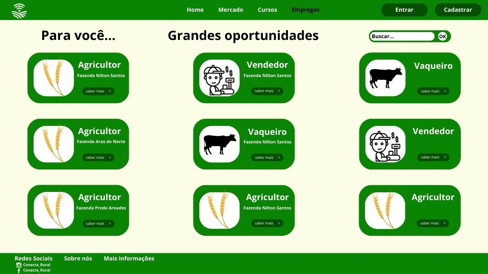

# Introdução

Informações básicas do projeto.

* **Projeto:** ConectaRural
* **Repositório GitHub:** https://github.com/ICEI-PUC-Minas-PMGES-TI/pmg-es-2025-1-ti1-2010200-conecta-rural.git
* **Membros da equipe:**

  * [Aldo Constantino Mendes](https://github.com/AldoCMendes) 
  * [Luiz Henrique Horta Oliveira](https://github.com/LuizHenriqueHO) 
  * [Daniel Bony Costa Garcia](https://github.com/DanielBonypucminas) 
  * [Gabriel De souza Aredes Coelho](https://github.com/ImGabrielAredes)
  * [Caio César Falinacio Dos Santos](https://github.com/CaioCFalinacio)

A documentação do projeto é estruturada da seguinte forma:

1. Introdução
2. Contexto
3. Product Discovery
4. Product Design
5. Metodologia
6. Solução
7. Referências Bibliográficas

✅ [Documentação de Design Thinking (MIRO)](https://miro.com/app/board/uXjVIZ5Had4=/?share_link_id=199441299517)

# Contexto

Moradores de áreas rurais que enfrentam dificuldade na compreensão de como usar a tecnologia ao seu favor, como, busca de empregos e entregas. Muitas vezes por falta de conhecimento ou por falta de oportunidades financeiras para comprar aparelhos eletrônicos adequados para serem usados no dia a dia. 

## Problema

Moradores de áreas rurais precisam de acesso a tecnologia e oportunidades, mas enfrentam falta de infraestrutura e inovação.


## Objetivos

Queremos criar um software, onde consigamos auxilia-los a como usar e para que consigam encontrar emprego ou para vender seus produtos de forma on-line.

## Justificativa

A Motivação foi por conta da nossa convivência com algumas pessoas das areas rurais, onde ja percebemos que estão um pouco atras de nos em relação a tecnologia e percebemos o quão importante e para elas compreenderem o seu uso, saber usar de forma a lhes ajudar a viver em harmonia e não tão distante de conhecimento tecnológico comparado aos cidadãos das cidades urbanas.

## Público-Alvo

Moradores de areas rurais, moradores de cidade muito pequenas e grandes e pequenos produtores.

# Product Discovery

## Etapa de Entendimento

* 
* 
* 
* 
* 
* 
* 
* 

## Etapa de Definição

### Personas

* 
* 
* 
* 


# Product Design

Nesse momento, vamos transformar os insights e validações obtidos em soluções tangíveis e utilizáveis. Essa fase envolve a definição de uma proposta de valor, detalhando a prioridade de cada ideia e a consequente criação de wireframes, mockups e protótipos de alta fidelidade, que detalham a interface e a experiência do usuário.

## Histórias de Usuários

Com base na análise das personas foram identificadas as seguintes histórias de usuários:

* 
* 

## Proposta de Valor

* 
* 
* 
* 

## Requisitos

As tabelas que se seguem apresentam os requisitos funcionais e não funcionais que detalham o escopo do projeto.

### Requisitos Funcionais

| ID     | Descrição do Requisito                                   | Prioridade |
| ------ | ---------------------------------------------------------- | ---------- |
| RF-001 | O sistema deve permitir o cadastro de novos usuários por meio de um formulário | ALTA       |
| RF-002 | Mostras os entregadores mais proximos para auxiliar nas entregas | BAIXA     |
| RF-003 | O sistema deve permitir que os usuários avaliem o vendedor | MÉDIA       |
| RF-004 | O sistema deve oferecer tutoriais interativos, dicas e FAQs para guiar o usuário no uso da plataforma. | ALTA    |
| RF-005 | O sistema deve gerar relatórios mensais de compras e vendas com resumo de valores, datas e estatísticas, disponíveis em PDF e CSV | BAIXO       |
| RF-006 | O sistema deve exibir vagas de emprego na área agrícola de acordo com o perfil, localização e interesses do usuário. | ALTA    |
| RF-007 | O sistema deve oferecer uma interface moderna, responsiva e fácil de usar, com foco em usabilidade, navegação fluida e exibição visual de produtos e perfis. | ALTA       |

### Requisitos não Funcionais

| ID      | Descrição do Requisito                                                              | Prioridade |
| ------- | ------------------------------------------------------------------------------------- | ---------- |
| RNF-001 | O sistema deve ser responsivo e adaptar sua interface para diferentes tamanhos de tela, incluindo dispositivos móveis, tablets e desktops. | ALTA    |
| RNF-002 | O sistema deve utilizar o protocolo HTTPS para garantir a segurança na troca de dados entre o usuário e o servidor.          | ALTA     |
| RNF-003 | O sistema deve adotar um design limpo, intuitivo e de fácil navegação. | ALTA       |
| RNF-004 | O sistema deve permitir a tradução da interface para outros idiomas, com base na preferência do usuário. | BAIXA     |
| RNF-005 | O sistema pode permitir a personalização da interface, como seleção de temas ou modo claro/escuro | BAIXA       |
| RNF-006 | O sistema deve suportar picos de acesso simultâneo sem comprometer a performance ou estabilidade.  | MÉDIA    |
| RNF-007 | O sistema deve utilizar cache para acelerar o carregamento de conteúdos estáticos e melhorar a experiência do usuário.  | MÉDIA    


## Projeto de Interface

Artefatos relacionados com a interface e a interacão do usuário na proposta de solução.

### Wireframes

Estes são os protótipos de telas do sistema.


### Protótipo Interativo





# Metodologia

Detalhes sobre a organização do grupo e o ferramental empregado.

## Ferramentas

Relação de ferramentas empregadas pelo grupo durante o projeto.

| Ambiente                    | Plataforma | Link de acesso                                     |
| --------------------------- | ---------- | -------------------------------------------------- |
| Processo de Design Thinking | Miro       |https://miro.com/app/board/uXjVIZ5Had4=/?share_link_id=199441299517        |
| Repositório de código     | GitHub     | https://github.com/ICEI-PUC-Minas-PMGES-TI/pmg-es-2025-1-ti1-2010200-conecta-rural.git      |
| Hospedagem do site          | Render     | https://site.render.com/XXXXXXX ⚠️ EXEMPLO ⚠️ |
| Protótipo Interativo       | MarvelApp  | https://marvelapp.com/XXXXXXX ⚠️ EXEMPLO ⚠️   |
|                             |            |                                                    |

> ⚠️ **APAGUE ESSA PARTE ANTES DE ENTREGAR SEU TRABALHO**
>
> Liste as ferramentas empregadas no desenvolvimento do projeto, justificando a escolha delas, sempre que possível. Inclua itens como: (1) Editor de código, (2) )ferramentas de comunicação, (3) )ferramentas de diagramação, (4) )plataformas de hospedagem, entre outras.

## Gerenciamento do Projeto

Divisão de papéis no grupo e apresentação da estrutura da ferramenta de controle de tarefas (Kanban).


> ⚠️ **APAGUE ESSA PARTE ANTES DE ENTREGAR SEU TRABALHO**
>
> Nesta parte do documento, você deve apresentar  o processo de trabalho baseado nas metodologias ágeis, a divisão de papéis e tarefas, as ferramentas empregadas e como foi realizada a gestão de configuração do projeto via GitHub.
>
> Coloque detalhes sobre o processo de Design Thinking e a implementação do Framework Scrum seguido pelo grupo. O grupo poderá fazer uso de ferramentas on-line para acompanhar o andamento do projeto, a execução das tarefas e o status de desenvolvimento da solução.
>
> **Orientações**:
>
> - [Sobre Projects - GitHub Docs](https://docs.github.com/pt/issues/planning-and-tracking-with-projects/learning-about-projects/about-projects)
> - [Gestão de projetos com GitHub | balta.io](https://balta.io/blog/gestao-de-projetos-com-github)
> - [(460) GitHub Projects - YouTube](https://www.youtube.com/playlist?list=PLiO7XHcmTsldZR93nkTFmmWbCEVF_8F5H)
> - [11 Passos Essenciais para Implantar Scrum no seu Projeto](https://mindmaster.com.br/scrum-11-passos/)
> - [Scrum em 9 minutos](https://www.youtube.com/watch?v=XfvQWnRgxG0)

# Solução Implementada

Esta seção apresenta todos os detalhes da solução criada no projeto.

## Vídeo do Projeto

O vídeo a seguir traz uma apresentação do problema que a equipe está tratando e a proposta de solução. ⚠️ EXEMPLO ⚠️

[](https://www.youtube.com/embed/70gGoFyGeqQ)

> ⚠️ **APAGUE ESSA PARTE ANTES DE ENTREGAR SEU TRABALHO**
>
> O video de apresentação é voltado para que o público externo possa conhecer a solução. O formato é livre, sendo importante que seja apresentado o problema e a solução numa linguagem descomplicada e direta.
>
> Inclua um link para o vídeo do projeto.

## Funcionalidades

Esta seção apresenta as funcionalidades da solução.Info

##### Funcionalidade 1 - Cadastro de Contatos ⚠️ EXEMPLO ⚠️

Permite a inclusão, leitura, alteração e exclusão de contatos para o sistema

* **Estrutura de dados:** [Contatos](#ti_ed_contatos)
* **Instruções de acesso:**
  * Abra o site e efetue o login
  * Acesse o menu principal e escolha a opção Cadastros
  * Em seguida, escolha a opção Contatos
* **Tela da funcionalidade**:


> ⚠️ **APAGUE ESSA PARTE ANTES DE ENTREGAR SEU TRABALHO**
>
> Apresente cada uma das funcionalidades que a aplicação fornece tanto para os usuários quanto aos administradores da solução.
>
> Inclua, para cada funcionalidade, itens como: (1) titulos e descrição da funcionalidade; (2) Estrutura de dados associada; (3) o detalhe sobre as instruções de acesso e uso.

## Estruturas de Dados

Descrição das estruturas de dados utilizadas na solução com exemplos no formato JSON.Info

##### Estrutura de Dados - Contatos   ⚠️ EXEMPLO ⚠️

Contatos da aplicação

```json
  {
    "id": 1,
    "nome": "Leanne Graham",
    "cidade": "Belo Horizonte",
    "categoria": "amigos",
    "email": "Sincere@april.biz",
    "telefone": "1-770-736-8031",
    "website": "hildegard.org"
  }
  
```

##### Estrutura de Dados - Usuários  ⚠️ EXEMPLO ⚠️

Registro dos usuários do sistema utilizados para login e para o perfil do sistema

```json
  {
    id: "eed55b91-45be-4f2c-81bc-7686135503f9",
    email: "admin@abc.com",
    id: "eed55b91-45be-4f2c-81bc-7686135503f9",
    login: "admin",
    nome: "Administrador do Sistema",
    senha: "123"
  }
```

> ⚠️ **APAGUE ESSA PARTE ANTES DE ENTREGAR SEU TRABALHO**
>
> Apresente as estruturas de dados utilizadas na solução tanto para dados utilizados na essência da aplicação quanto outras estruturas que foram criadas para algum tipo de configuração
>
> Nomeie a estrutura, coloque uma descrição sucinta e apresente um exemplo em formato JSON.
>
> **Orientações:**
>
> * [JSON Introduction](https://www.w3schools.com/js/js_json_intro.asp)
> * [Trabalhando com JSON - Aprendendo desenvolvimento web | MDN](https://developer.mozilla.org/pt-BR/docs/Learn/JavaScript/Objects/JSON)

## Módulos e APIs

Esta seção apresenta os módulos e APIs utilizados na solução

**Images**:

* Unsplash - [https://unsplash.com/](https://unsplash.com/) ⚠️ EXEMPLO ⚠️

**Fonts:**

* Icons Font Face - [https://fontawesome.com/](https://fontawesome.com/) ⚠️ EXEMPLO ⚠️

**Scripts:**

* jQuery - [http://www.jquery.com/](http://www.jquery.com/) ⚠️ EXEMPLO ⚠️
* Bootstrap 4 - [http://getbootstrap.com/](http://getbootstrap.com/) ⚠️ EXEMPLO ⚠️

> ⚠️ **APAGUE ESSA PARTE ANTES DE ENTREGAR SEU TRABALHO**
>
> Apresente os módulos e APIs utilizados no desenvolvimento da solução. Inclua itens como: (1) Frameworks, bibliotecas, módulos, etc. utilizados no desenvolvimento da solução; (2) APIs utilizadas para acesso a dados, serviços, etc.

# Referências

As referências utilizadas no trabalho foram:

* SOBRENOME, Nome do autor. Título da obra. 8. ed. Cidade: Editora, 2000. 287 p ⚠️ EXEMPLO ⚠️

> ⚠️ **APAGUE ESSA PARTE ANTES DE ENTREGAR SEU TRABALHO**
>
> Inclua todas as referências (livros, artigos, sites, etc) utilizados no desenvolvimento do trabalho.
>
> **Orientações**:
>
> - [Formato ABNT](https://www.normastecnicas.com/abnt/trabalhos-academicos/referencias/)
> - [Referências Bibliográficas da ABNT](https://comunidade.rockcontent.com/referencia-bibliografica-abnt/)
