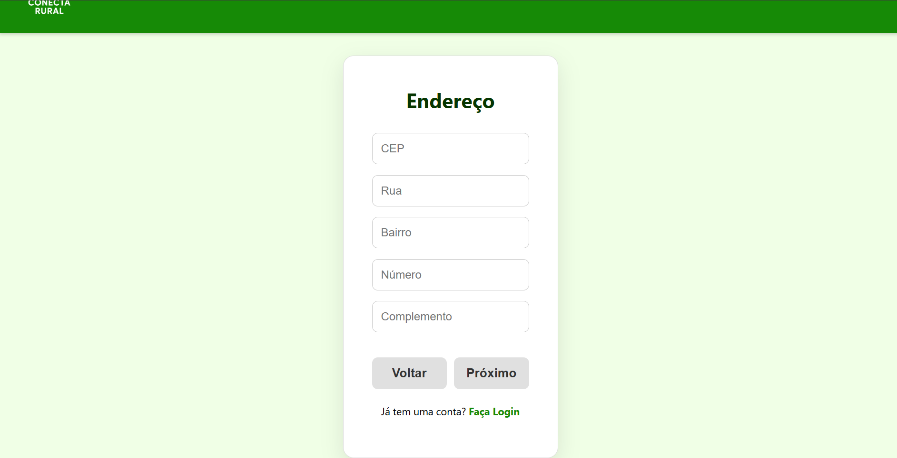

# Introdução

Informações básicas do projeto.

* **Projeto:** ConectaRural
* **Repositório GitHub:** https://github.com/ICEI-PUC-Minas-PMGES-TI/pmg-es-2025-1-ti1-2010200-conecta-rural.git
* **Membros da equipe:**

  * [Aldo Constantino Mendes](https://github.com/AldoCMendes) 
  * [Luiz Henrique Horta Oliveira](https://github.com/LuizHenriqueHO) 
  * [Daniel Bony Costa Garcia](https://github.com/DanielBonypucminas) 
  * [Gabriel De souza Aredes Coelho](https://github.com/ImGabrielAredes)
  * [Caio César Falinacio Dos Santos](https://github.com/CaioCFalinacio)

A documentação do projeto é estruturada da seguinte forma:

1. Introdução
2. Contexto
3. Product Discovery
4. Product Design
5. Metodologia
6. Solução
7. Referências Bibliográficas

✅ [Documentação de Design Thinking (MIRO)](https://miro.com/app/board/uXjVIZ5Had4=/?share_link_id=199441299517)

# Contexto

Moradores de áreas rurais que enfrentam dificuldade na compreensão de como usar a tecnologia ao seu favor, como, busca de empregos e entregas. Muitas vezes por falta de conhecimento ou por falta de oportunidades financeiras para comprar aparelhos eletrônicos adequados para serem usados no dia a dia. 

## Problema

Moradores de áreas rurais precisam de acesso a tecnologia e oportunidades, mas enfrentam falta de infraestrutura e inovação.


## Objetivos

Queremos criar um software, onde consigamos auxilia-los a como usar e para que consigam encontrar emprego ou para vender seus produtos de forma on-line.

## Justificativa

A Motivação foi por conta da nossa convivência com algumas pessoas das areas rurais, onde ja percebemos que estão um pouco atras de nos em relação a tecnologia e percebemos o quão importante e para elas compreenderem o seu uso, saber usar de forma a lhes ajudar a viver em harmonia e não tão distante de conhecimento tecnológico comparado aos cidadãos das cidades urbanas.

## Público-Alvo

Moradores de areas rurais, moradores de cidade muito pequenas e grandes e pequenos produtores.

# Product Discovery

## Etapa de Entendimento

* 
* 
* 
* 
* 
* 
* 
* 

## Etapa de Definição

### Personas

* 
* 
* 
* 


# Product Design

Nesse momento, vamos transformar os insights e validações obtidos em soluções tangíveis e utilizáveis. Essa fase envolve a definição de uma proposta de valor, detalhando a prioridade de cada ideia e a consequente criação de wireframes, mockups e protótipos de alta fidelidade, que detalham a interface e a experiência do usuário.

## Histórias de Usuários

Com base na análise das personas foram identificadas as seguintes histórias de usuários:

* 
* 

## Proposta de Valor

* 
* 
* 
* 

## Requisitos

As tabelas que se seguem apresentam os requisitos funcionais e não funcionais que detalham o escopo do projeto.

### Requisitos Funcionais

| ID     | Descrição do Requisito                                   | Prioridade |
| ------ | ---------------------------------------------------------- | ---------- |
| RF-001 | O sistema deve permitir o cadastro de novos usuários por meio de um formulário | ALTA       |
| RF-002 | Mostras os entregadores mais proximos para auxiliar nas entregas | BAIXA     |
| RF-003 | O sistema deve permitir que os usuários avaliem o vendedor | MÉDIA       |
| RF-004 | O sistema deve oferecer tutoriais interativos, dicas e FAQs para guiar o usuário no uso da plataforma. | ALTA    |
| RF-005 | O sistema deve gerar relatórios mensais de compras e vendas com resumo de valores, datas e estatísticas, disponíveis em PDF e CSV | BAIXO       |
| RF-006 | O sistema deve exibir vagas de emprego na área agrícola de acordo com o perfil, localização e interesses do usuário. | ALTA    |
| RF-007 | O sistema deve oferecer uma interface moderna, responsiva e fácil de usar, com foco em usabilidade, navegação fluida e exibição visual de produtos e perfis. | ALTA       |

### Requisitos não Funcionais

| ID      | Descrição do Requisito                                                              | Prioridade |
| ------- | ------------------------------------------------------------------------------------- | ---------- |
| RNF-001 | O sistema deve ser responsivo e adaptar sua interface para diferentes tamanhos de tela, incluindo dispositivos móveis, tablets e desktops. | ALTA    |
| RNF-002 | O sistema deve utilizar o protocolo HTTPS para garantir a segurança na troca de dados entre o usuário e o servidor.          | ALTA     |
| RNF-003 | O sistema deve adotar um design limpo, intuitivo e de fácil navegação. | ALTA       |
| RNF-004 | O sistema deve permitir a tradução da interface para outros idiomas, com base na preferência do usuário. | BAIXA     |
| RNF-005 | O sistema pode permitir a personalização da interface, como seleção de temas ou modo claro/escuro | BAIXA       |
| RNF-006 | O sistema deve suportar picos de acesso simultâneo sem comprometer a performance ou estabilidade.  | MÉDIA    |
| RNF-007 | O sistema deve utilizar cache para acelerar o carregamento de conteúdos estáticos e melhorar a experiência do usuário.  | MÉDIA    


## Projeto de Interface

Artefatos relacionados com a interface e a interacão do usuário na proposta de solução.

### Wireframes

Estes são os protótipos de telas do sistema.


### Protótipo Interativo


# Metodologia

Detalhes sobre a organização do grupo e o ferramental empregado.

## Ferramentas

Relação de ferramentas empregadas pelo grupo durante o projeto.

| Ambiente                    | Plataforma | Link de acesso                                     |
| --------------------------- | ---------- | -------------------------------------------------- |
| Processo de Design Thinking | Miro       |https://miro.com/app/board/uXjVIZ5Had4=/?share_link_id=199441299517        |
| Repositório de código     | GitHub     | https://github.com/ICEI-PUC-Minas-PMGES-TI/pmg-es-2025-1-ti1-2010200-conecta-rural.git      |
| Hospedagem do site          | paint     |  |
| Protótipo Interativo       | Canva  | https://www.canva.com/pt_br/ |
|                             |            |                                                    |


## Gerenciamento do Projeto

Divisão de papéis no grupo e apresentação da estrutura da ferramenta de controle de tarefas (Kanban).


Nosso grupo utilizou do proprio GitHub para auxiliar as divisões de tarefas, colocávamos o que tínhamos que fazer, o que estava em andamento e quando finalizávamos cara parte. Não tivemos nenhum problema em organização e falta de responsabilidade de alguém do grupo, fluímos de forma tranquila e eficiente com cada um fazendo o que devia ser feito.
# Solução Implementada

Esta seção apresenta todos os detalhes da solução criada no projeto.

## Vídeo do Projeto

O vídeo a seguir traz uma apresentação do problema que a equipe está tratando e a proposta de solução. ⚠️ EXEMPLO ⚠️

[](https://www.youtube.com/embed/70gGoFyGeqQ)

> ⚠️ **APAGUE ESSA PARTE ANTES DE ENTREGAR SEU TRABALHO**
>
> O video de apresentação é voltado para que o público externo possa conhecer a solução. O formato é livre, sendo importante que seja apresentado o problema e a solução numa linguagem descomplicada e direta.
>
> Inclua um link para o vídeo do projeto.

## Funcionalidades

Esta seção apresenta as funcionalidades da solução.Info

##### Funcionalidade 1 - Cadastro de Usuarios 

Permite a inclusão de um perfil de usuário.

* **Instruções de acesso:**
  * Abra o site 
  * Acesse o menu principal e escolha a opção Cadastrar
  * Em seguida realize seu cadastro

* **Tela da funcionalidade Cadastro**:

![Tela de Funcionalidade-1 pt1]
![Tela de Funcionalidade-1 pt2]
![Tela de Funcionalidade-1 pt3]

##### Estrutura de Dados - Cadastro   

```json
  {
    "id": 1,
    "nome": "Leanne Graham",
    "sobrenome": "Horta Santos",
    "data-nasciento": "18/04/2006",
    "CPF": "10248890670",
    "CEP": "3293029",
    "Rua": "agostinho bretas",
    "bairro": "Caiçara",
    "numero": "1",
    "complemento": "apt 403",
    "Email": "abc@gmail.com",
    "Senha": "3293029"
  }
  
```

##### Funcionalidade 2 - Cadastro de Emprego

Permite a inclusão de um novo emprego no site.

* **Instruções de acesso:**
  * Abra o site 
  * Acesse o menu de emprego e escolha a opção cadastrar vaga.
  * Em seguida realize o cadastro

* **Tela da funcionalidade Cadastro de Emprego**:

![Tela de Funcionalidade-2]!

##### Estrutura de Dados - Cadastro de Emprego 

```json
  {
      "id": "1",
      "tituloVaga": "Tratorista",
      "descricao": "Vaga para tratorista com experiência em operação de máquinas agrícolas e manutenção básica.",
      "local": "Fazenda São Miguel",
      "responsavel": "Henrique Fagundes",
      "contato": "(31)92345-7843",
      "requisitos": "Ter experiência na gestão de tratores, focado na sua funcionalidade e praticidade."
    },
  
```

## Módulos e APIs

Esta seção apresenta os módulos e APIs utilizados na solução

**Scripts:**

* jQuery - [http://www.jquery.com/](http://www.jquery.com/) 
* Bootstrap 4 - [http://getbootstrap.com/](http://getbootstrap.com/) 
* Google Maps - [https://developers.google.com/maps](https://developers.google.com/maps)
* Swiper.js - [https://swiperjs.com/]( https://swiperjs.com/)
* Node.js - [ https://nodejs.org/pt]( https://nodejs.org/pt)


